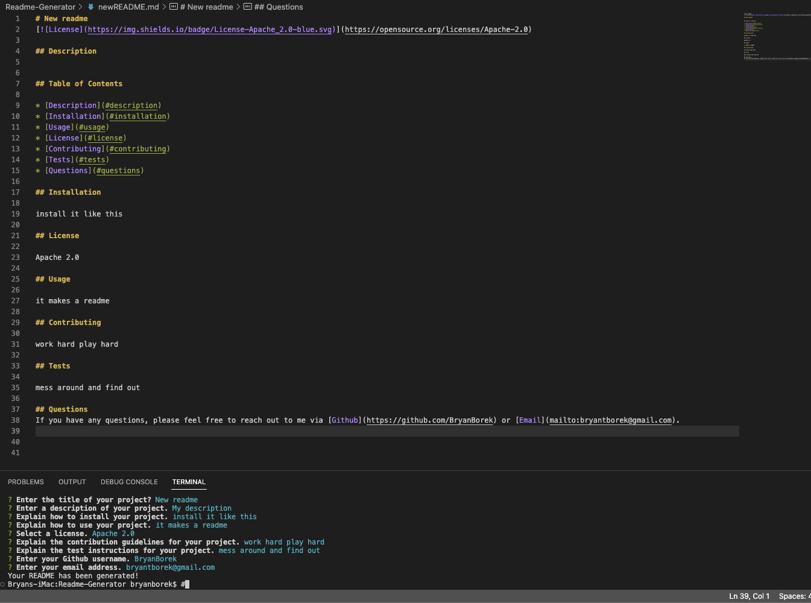

# 09 Readme Generator

## Work smarter not harder!

```
This is a readme generator with the following title of my project 
and sections entitled Description, Table of Contents, Installation, 
Usage, License, Contributing, Tests, and Questions.
```

## Mock-up



## Links

Github repository link: https://github.com/BryanBorek/Readme-Generator